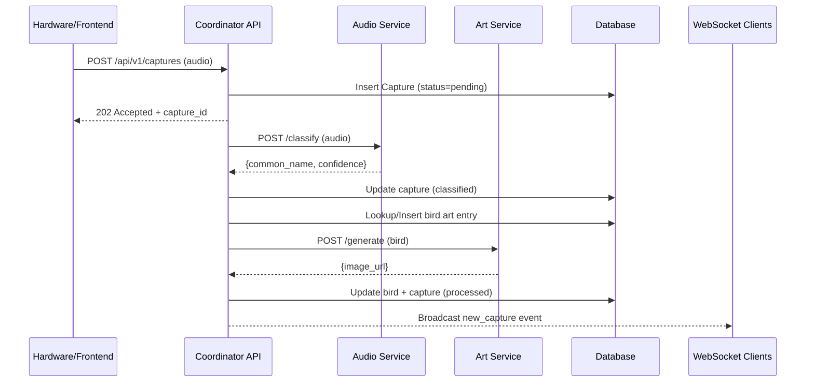

# Chirp Neighbor Product Requirements Document (PRD)

## Table of Contents
- [1. 🐦 Product Requirements (PRD)](#1--product-requirements-prd)
  - [1.1 Overview](#11-overview)
  - [1.2 System Goals](#12-system-goals)
  - [1.3 Core Components & Responsibilities](#13-core-components--responsibilities)
  - [1.4 Core Data Flow (Async "Happy Path")](#14-core-data-flow-async-happy-path)
- [2. 🏛️ System-Wide Design Decisions](#2--system-wide-design-decisions)
- [3. 📋 API Specification (The Skeleton)](#3--api-specification-the-skeleton)
- [4. 🚀 Implementation Plan](#4--implementation-plan)
- [5. 🎛️ ML Inference Service Plans](#5--ml-inference-service-plans)
  - [5.1 Audio Inference (birdnet-service)](#51-audio-inference-birdnet-service)
  - [5.2 Art Inference (pixelart-service)](#52-art-inference-pixelart-service)
- [6. 🧰 MLOps Roadmap](#6--mlops-roadmap)
- [7. ⚡ Streaming Backend & Coordinator Performance Plan](#7--streaming-backend--coordinator-performance-plan)
  - [7.1 Coordinator Throughput Hardening](#71-coordinator-throughput-hardening)
  - [7.2 Realtime Streaming Gateway (C++ Service)](#72-realtime-streaming-gateway-c-service)
  - [7.3 Observability & Load Verification](#73-observability--load-verification)
- [8. 🛰️ Backend & WebSocket Implementation Plan](#8--backend--websocket-implementation-plan)
  - [8.1 Backend Developer Action Plan](#81-backend-developer-action-plan)
  - [8.2 WebSocket Engineer Action Plan](#82-websocket-engineer-action-plan)
  - [8.3 Load, Reliability, and Runbooks](#83-load-reliability-and-runbooks)

## 1. 🐦 Product Requirements (PRD)

### 1.1 Overview
Chirp Neighbor is a microservice-based system designed to capture, identify, and display backyard bird sounds. Users (starting with a single user) will use hardware to record audio, which is then classified by an ML model. The classified bird is presented back to the user on a frontend, complete with generated pixel art and a history of their "discovered" birds.

### 1.2 System Goals
- **Decoupled**: The system must be split into distinct services (microservices) to separate concerns. Specifically, resource-intensive ML inference must not block or slow down the main user-facing API.
- **Asynchronous**: The user/hardware should get an immediate response upon uploading audio. The classification and art generation will happen in the background.
- **Real-time Feedback**: The frontend must update "live" when a new bird is identified without the user needing to refresh the page.
- **Scalable**: Each service (API, Audio ML, Art ML) must be independently scalable. (e.g., we can run the Art service on a GPU machine and the Audio service on a CPU-heavy machine).

### 1.3 Core Components & Responsibilities
This architecture consists of three (3) distinct backend services.

#### The Coordinator (Main Backend)
- **Purpose**: The "brain" of the operation. It is the only service the frontend and hardware will talk to directly.
- **Responsibilities**:
  - Manages all user accounts and authentication (JWT).
  - Manages the master SQL database (User, Bird, Capture tables).
  - Manages all WebSocket connections for real-time frontend updates.
  - Accepts audio uploads and saves them to disk/storage.
  - Orchestrates the async workflow by calling the other two services.
- **Tech**: FastAPI, SQLModel, WebSockets, httpx (for calling other services).

#### Audio Inference Service (birdnet-service)
- **Purpose**: The "ear." A specialized, internal-only service.
- **Responsibilities**:
  - Exposes a single API endpoint.
  - Receives an audio file.
  - Uses birdnetlib (or other models) to classify the species.
  - Returns a simple JSON response with the classification.
- **Tech**: FastAPI, birdnetlib, numpy, soundfile.

#### Art Inference Service (pixelart-service)
- **Purpose**: The "artist." A specialized, internal-only service.
- **Responsibilities**:
  - Exposes a single API endpoint.
  - Receives a bird name (e.g., "American Robin").
  - Uses a generative model (e.g., Stable Diffusion) to create a 2D pixel art representation.
  - Saves the art to a shared location and returns its path/URL.
- **Tech**: FastAPI, PyTorch/TensorFlow, Diffusers, etc.

### 1.4 Core Data Flow (Async "Happy Path")
1. **[Frontend/Hardware]** `POST /api/v1/captures` with an audio file to the Coordinator.
2. **[Coordinator]** immediately:
   - Saves the raw audio file to a `data/uploads/` directory.
   - Creates a Capture record in the database (e.g., `status="pending"`).
   - Schedules a background task to process this capture.
   - Returns a `202 Accepted` to the hardware.
3. **[Coordinator Background Task]**:
   - Uses httpx to send the audio file to the Audio Service (`POST /classify`).
4. **[Audio Service]** processes the file and returns `{ "common_name": "American Robin", ... }`.
5. **[Coordinator Background Task]**:
   - Updates the Capture in the DB with the bird ID and sets `status="processed"`.
   - Checks the Bird table: "Do we have pixel art for 'American Robin'?"
   - If **NO**: Uses httpx to call the Art Service (`POST /generate`, `{ "name": "American Robin" }`).
6. **[Art Service]** generates the image, saves it to `data/art/`, and returns `{ "image_url": "data/art/american_robin.png" }`.
7. **[Coordinator Background Task]** saves this `image_url` to the Bird table.
8. **[Coordinator]**:
   - Finds the WebSocket connection for the user.
   - Pushes a JSON message: `{ "event": "new_capture", "data": {...} }`.
9. **[Frontend]** receives the WebSocket message and displays the new bird and animation.



## 2. 🏛️ System-Wide Design Decisions
- **Authentication**: JWT (JSON Web Tokens). The Coordinator will have token and register endpoints. All user-facing endpoints (`/captures`, `/birds`, `/ws`) will be protected. Internal services (`/classify`, `/generate`) are not publicly exposed and are trusted within the private network (e.g., Docker Compose network).
- **Storage**: The Coordinator's local file system will be used for v1.0. The database will store paths to these files.
  - `data/uploads/`: For raw `.wav` files.
  - `data/art/`: For generated pixel art.
  - **Architect's Note**: For production, this `data/` directory would be replaced with a managed object store (like AWS S3 or Cloudflare R2) and the services would communicate via signed URLs.
- **Standard Error Response**: All APIs will return errors in a consistent JSON format.

```json
{ "detail": "A human-readable error message." }
```

## 3. 📋 API Specification (The Skeleton)
This section defines the precise API contracts for all three services.

### Service 1: The Coordinator
- **Base URL**: `http://localhost:8000`
- **Authentication**: (Auth) denotes endpoints that require a `Authorization: Bearer <token>` header.

#### Auth Endpoints
- `POST /api/v1/auth/token`
  - **Description**: Get an access token (OAuth2-style password flow).
  - **Request Body**: `application/x-www-form-urlencoded` with `username` and `password`.
  - **Response (200 OK)**: `{ "access_token": "...", "token_type": "bearer" }`
- `POST /api/v1/users`
  - **Description**: Create a new user account.
  - **Request Body**: `{ "username": "...", "email": "...", "password": "..." }`
  - **Response (201 Created)**: `{ "id": 1, "username": "..." }`

#### Capture Endpoints
- `POST /api/v1/captures` (Auth)
  - **Description**: Upload a new audio file for classification. This is the main hardware endpoint.
  - **Request Body**: `multipart/form-data` with a file named `audio_file`.
  - **Response (202 Accepted)**: `{ "message": "Capture accepted for processing.", "capture_id": 123 }`
- `GET /api/v1/captures` (Auth)
  - **Description**: Get a paginated list of the user's past captures.
  - **Response (200 OK)**: `{ "captures": [...], "page": 1, "total": 10 }`
- `GET /api/v1/captures/{capture_id}` (Auth)
  - **Description**: Get the status and details of a specific capture.
  - **Response (200 OK)**: `{ "id": 123, "status": "processed", "bird": {...} }`

#### Bird Endpoints
- `GET /api/v1/birds` (Auth)
  - **Description**: Get all unique birds the user has "discovered."
  - **Response (200 OK)**: `[ { "common_name": "American Robin", "pixel_art_url": "...", ... } ]`

#### Real-time Endpoint
- `WS /ws` (Auth)
  - **Description**: The WebSocket endpoint for real-time updates.
  - **Auth**: Requires token as a query parameter (e.g., `wss://.../ws?token=...`).
  - **Server Push**: `{ "event": "new_capture", "data": {...capture_details...} }`

### Service 2: Audio Inference Service
- **Base URL**: `http://localhost:8001` (Internal Only)
- `POST /classify`
  - **Description**: Classifies a single audio file.
  - **Request Body**: `multipart/form-data` with a file named `audio_file`.
  - **Response (200 OK)**:

```json
{ "scientific_name": "Turdus migratorius", "common_name": "American Robin", "confidence": 0.92 }
```
  - **Response (500 Error)**: `{ "detail": "Audio classification failed." }`

### Service 3: Art Inference Service
- **Base URL**: `http://localhost:8002` (Internal Only)
- `POST /generate`
  - **Description**: Generates pixel art for a given bird.
  - **Request Body**:

```json
{ "common_name": "American Robin", "scientific_name": "Turdus migratorius" }
```
  - **Response (200 OK)**:

```json
{ "image_url": "data/art/turdus_migratorius.png" }
```
  - **Response (500 Error)**: `{ "detail": "Pixel art generation failed." }`

## 4. 🚀 Implementation Plan
The roadmap below expands the earlier outline into concrete, testable tasks so that each service team understands their deliverables and dependencies.

### Step 1 – Coordinator Foundations
- **Deliverables**:
  - FastAPI project scaffold with `app/main.py`, `app/api`, and `app/core` packages.
  - SQLModel-based `User`, `Bird`, and `Capture` models plus Alembic migrations.
  - `/api/v1/users` registration endpoint with password hashing + validation.
  - `/api/v1/auth/token` OAuth2 password flow endpoint issuing JWTs.
- **Acceptance**:
  - Automated tests covering auth flows (happy path + invalid credentials).
  - Ruff + pytest pass inside `backend/` CI workflow.

### Step 2 – Mock Inference Services
- **Deliverables**:
  - `backend-inference/birdnet-service` FastAPI microservice exposing `POST /classify`.
  - `backend-inference/pixelart-service` FastAPI microservice exposing `POST /generate`.
  - Deterministic stub responses (e.g., always "American Robin") stored under `data/art/placeholder.png` for frontend visibility.
- **Acceptance**:
  - Docker Compose entries allowing all three services to run locally.
  - Health checks confirming both services respond <200 ms on sample hardware.

### Step 3 – Capture Workflow & Background Processing
- **Deliverables**:
  - `/api/v1/captures` endpoint storing uploads in `data/uploads/` and queuing processing tasks (FastAPI `BackgroundTasks` or Celery worker for future scalability).
  - `process_capture` task orchestrating calls to Audio + Art services via `httpx.AsyncClient` with retry/backoff.
  - Database updates that transition captures through `pending → classified → processed` statuses with timestamps.
- **Acceptance**:
  - Integration test simulating upload → classification → art generation.
  - Sequence diagram + log sample demonstrating async behavior.

### Step 4 – Real-time Delivery
- **Deliverables**:
  - WebSocket manager tracking active user connections with token validation.
  - Publish/subscribe mechanism bridging background tasks to the WS manager.
  - Frontend demo page (or CLI subscriber) proving events broadcast instantly when a capture is processed.
- **Acceptance**:
  - Load test of 100 concurrent sockets maintaining <100 ms delivery latency inside LAN.
  - Automated test ensuring unauthorized sockets are rejected.

### Step 5 – Production-Grade ML Swap
- **Deliverables**:
  - Replace mock inference with real birdnetlib + diffusion models, including model download scripts and caching strategy.
  - GPU/CPU specific deployment notes plus observability (Prometheus metrics for inference time, queue depth, failure counts).
  - Graceful degradation path (fall back to cached art if generation fails).
- **Acceptance**:
  - Benchmark report showing classification <1 s on CPU tier, art generation <10 s on GPU tier.
  - Post-deployment smoke tests across all services.

We want to make sure we have a FULLY fleshed out plan. After you commit this... we are going to make specific plans for each part!

## 5. 🎛️ ML Inference Service Plans
These deep-dive plans outline how the ML engineering team will build, validate, and operate the two inference services. Each plan balances model accuracy with strict latency and reliability targets so the Coordinator can safely orchestrate asynchronous jobs.

### 5.1 Audio Inference (birdnet-service)
- **Objectives**:
  - Deliver top-5 bird classification accuracy ≥ 92 % on backyard datasets.
  - Maintain p95 end-to-end inference latency < 600 ms for 10 s clips on CPU-only nodes.
  - Provide confidence scores and optional embeddings for downstream personalization.
- **Pipeline & Model Strategy**:
  - Curate training data combining BirdNET dataset + crowdsourced backyard captures. Apply loudness normalization, band-pass filtering (1–8 kHz), and Mel-spectrogram extraction with 48 kHz → 32 kHz downsampling.
  - Fine-tune BirdNET or EfficientNet-based classifier using transfer learning; leverage mixed-precision training where GPUs are available.
  - Export ONNX + TorchScript artifacts; validate numerically against training checkpoints before publishing.
- **Service Architecture**:
  - FastAPI app with `/classify` endpoint accepting multipart audio; convert to PCM WAV, run preprocessing, then dispatch to inference runtime (ONNX Runtime preferred for CPU efficiency).
  - Integrate request batching (up to 4 clips) and optional caching keyed by SHA256 of audio payload.
  - Expose Prometheus metrics: `classification_latency_ms`, `model_load_seconds`, `queue_depth`, and error counts. Emit structured logs with bird species + confidence for analytics.
- **Testing & Validation**:
  - Unit tests for preprocessing (FFT windowing, normalization), model wrapper, and response schema.
  - Golden-audio regression suite executed in CI to catch drift when updating weights.
  - Load test profile: 50 RPS sustained for 5 minutes with <1 % error budget.
- **Deployment Checklist**:
  - Container image with pinned model hash and startup health probes verifying weights download + warmup pass.
  - Horizontal Pod Autoscaler (or Compose equivalent) scaling between 1–6 replicas based on CPU usage and queue depth.
  - Runbook covering model rollback, cold-start warming, and troubleshooting (e.g., audio decoding failures).

### 5.2 Art Inference (pixelart-service)
- **Objectives**:
  - Generate 64×64 (or configurable) pixel art sprites within 8 s p95 latency on a single A10/T4 GPU.
  - Ensure deterministic outputs per species by seeding RNG with hashed bird name unless explicitly overridden.
  - Produce transparent-background PNGs optimized (<150 KB) for real-time delivery.
- **Pipeline & Model Strategy**:
  - Start with a diffusion or ControlNet pipeline fine-tuned on curated pixel-art bird sprites; include LoRA adapters for rapid iteration.
  - Pre-build textual prompts combining scientific/common names + style tokens (“pixel art, 16-bit, vibrant”).
  - Post-process images via palette quantization and outline enhancement (e.g., Pillow + custom shaders) before storage.
- **Service Architecture**:
  - FastAPI `/generate` endpoint consuming JSON payload; orchestrate GPU inference through a worker pool (Celery or asyncio queue) so HTTP threads remain responsive.
  - Persist results to `data/art/` (local) or object storage bucket; return signed URL plus metadata (palette, seed, checksum).
  - Implement cache lookup to skip regeneration if sprite already exists and cache TTL hasn’t expired.
- **Testing & Validation**:
  - Snapshot tests verifying generated images match approved fixtures for select birds (hash comparison within tolerance).
  - Style/quality evaluator script measuring color diversity and silhouette contrast to guard against regressions.
  - Stress test of 20 concurrent requests with automatic GPU memory reclamation; fail gracefully with queued retries.
- **Deployment Checklist**:
  - Container image with CUDA + model weights baked in; health checks confirm GPU availability and VRAM headroom.
  - Autoscaling via GPU queue length; alert if generation latency >10 s or success rate <99 % over 15 min window.
  - Disaster recovery plan storing sprites + metadata in replicated storage, enabling instant reuse after redeploys.

## 6. 🧰 MLOps Roadmap
To keep both inference services healthy over time, we need shared MLOps infrastructure that automates training, deployment, and monitoring across environments.

- **Experiment Tracking & Model Registry**
  - Standardize on MLflow (self-hosted) for logging parameters, metrics, and artifacts. Every training run must register resulting models with semantic versioning (`audio-vMAJOR.MINOR.PATCH`).
  - Enforce metadata capture: dataset snapshot hash, preprocessing config, evaluation metrics, and validation datasets.
- **CI/CD for Models**
  - Add GitHub Actions (or equivalent) workflows that: (1) run unit + regression tests, (2) trigger training pipelines via workflow dispatch, (3) package models into OCI images, and (4) publish to container registry only after approval gates.
  - Implement blue/green deployment strategy for inference services. Roll out new model versions to staging, run smoke + load tests, then promote to production with automated rollback on SLO breach.
- **Data & Feature Management**
  - Store curated datasets in DVC-backed buckets with checksum verification; integrate pre-processing scripts into reusable pipelines.
  - Schedule nightly data validation (Great Expectations) to catch schema drift or corrupt audio/image assets.
- **Monitoring & Alerting**
  - Centralize logs + metrics in Grafana stack. Track model-specific metrics (accuracy proxy via periodic labeled samples, image quality scores), infrastructure metrics (CPU/GPU utilization), and cost dashboards.
  - Configure alerts for drift detection (KL divergence on embeddings/confidence distributions), latency breaches, and failure spikes.
- **Automation & Governance**
  - Define IaC (Terraform) modules for shared resources (object storage, registries, monitoring). All environments (dev/stage/prod) created via GitOps to ensure parity.
  - Document runbooks covering retraining cadence, security reviews, and compliance (PII handling, access control). Include automated backups of registries and datasets.

These ML-focused plans give the Coordinator team clear contracts while enabling the ML/MLOps engineers to iterate independently without jeopardizing real-time user experiences.

## 7. ⚡ Streaming Backend & Coordinator Performance Plan
Our backend and streaming layers must keep pace with the low-latency goals promised by the ML roadmap. This section captures the concrete deliverables for the Python Coordinator as well as a companion C++ streaming gateway that can soak up bursty audio uploads from embedded devices without overwhelming FastAPI workers.

### 7.1 Coordinator Throughput Hardening
- **Objectives**
  - Maintain <150 ms median response time for `POST /api/v1/captures` even at 200 concurrent uploaders.
  - Keep WebSocket broadcast latency <50 ms for 95th percentile fan-out events.
  - Guarantee graceful degradation when downstream inference services exceed p95 latency budgets by pausing intake and surfacing backpressure metrics.
- **Action Plan**
  - Adopt uvloop and configure FastAPI/uvicorn with tuned worker/process counts per deployment target (minimum 2× CPU cores, shared keep-alive pools).
  - Push blocking file I/O and checksum calculations onto a dedicated asyncio TaskGroup so request handlers remain non-blocking; leverage memory-mapped staging to avoid extra copies.
  - Introduce Redis (or in-process) rate limiter enforcing per-device and global burst quotas with exponential backoff responses to embedded clients.
  - Upgrade WebSocket manager to use an internal publish/subscribe bus (asyncio Queue + task pool) so message fan-out no longer blocks inference completion handlers.
  - Define retry/circuit-breaker policies for the inference httpx clients: jittered exponential backoff, request deadlines, and fallback to cached results on repeated 5xx errors.

### 7.2 Realtime Streaming Gateway (C++ Service)
- **Purpose**: Build a lightweight edge service that terminates embedded TCP/WebSocket sessions, performs packet validation, and streams audio chunks into the Coordinator via gRPC/WebSocket bridges. Written in modern C++23 to guarantee zero-copy parsing and deterministic latency.
- **Architecture Highlights**
  - Use `asio` (standalone) with coroutines for fully asynchronous socket handling; limit dynamic allocations via monotonic buffers and object pools.
  - Implement TLS termination (mbedTLS or OpenSSL) with session resumption for ESP32 clients; support mutual-auth certificates for future fleet expansion.
  - Packet pipeline: (1) header parser validating sequence numbers + CRC, (2) ring buffer aligned to cache lines, (3) optional Opus compression before forwarding.
  - Provide gRPC streaming client to the Coordinator for multiplexed uploads; maintain adaptive batching (combine ≤4 clips) to reduce syscalls without harming latency.
  - Expose Prometheus endpoint with per-connection throughput, queue depth, retransmission counts, and CPU/memory usage. Target <2 MB RSS per 100 simultaneous devices.
- **Reliability Requirements**
  - Watchdog thread verifying coroutine event loop progress (<5 ms stall) and triggering process restart if hung.
  - Comprehensive unit tests (doctest/Catch2) covering parsers, CRC, backpressure state machine, and graceful shutdown semantics.
  - CI build with `-Wall -Wextra -Wpedantic`, clang-tidy profile, and ASan/UBSan jobs to maintain memory safety guarantees.

### 7.3 Observability & Load Verification
- **Synthetic Streaming Tests**
  - Develop a Rust or Python load generator capable of emulating 500+ ESP32 nodes pushing 48 kHz PCM chunks and websocket keep-alives; integrate into CI nightly job.
  - Record metrics: capture queue depth, request latency histograms, coordinator CPU/memory, gateway RSS, and network utilization. Define pass/fail SLOs.
- **Dashboards & Alerts**
  - Grafana dashboards correlating Coordinator FastAPI metrics with gateway Prometheus data to quickly identify whether backpressure originates at the edge or core.
  - Alerts for: sustained >70 % CPU on streaming gateway, coordinator p95 latency >300 ms for 5 minutes, WebSocket drop rate >0.5 %, and TLS handshake error spikes.
- **Disaster Readiness**
  - Chaos experiments (quarterly) that drop inference services or introduce 10 % packet loss; verify gateway retransmission + coordinator rate limiting protect uptime.
  - Document rollback procedures for both the FastAPI and C++ services, including how to drain connections without losing buffered audio.

## 8. 🛰️ Backend & WebSocket Implementation Plan
This section captures what the backend and real-time specialists need to deliver so the Coordinator keeps pace with the embedded streaming gateway and the ML services. It pairs the API/back-office guardrails with the WebSocket strategy required for live bird updates.

### 8.1 Backend Developer Action Plan
- **API & Data Layer**
  - Stand up FastAPI + SQLModel with async connection pooling (PostgreSQL) and migrations; enforce consistent JSON error envelope and rate limiting aligned with Section 7.1 quotas.
  - Define capture/bird/user schemas with optimistic concurrency guards and row-level tenancy; add `status_sample_count` exposure so `/status.json` matches the embedded diagnostics.
  - Publish OpenAPI docs and JSON Schemas for `/captures`, `/birds`, `/auth`, and `/ws` handshake payloads; generate typed clients for frontend + C++ gateway.
- **Workflow & Resilience**
  - Move blocking work (file hashing, storage writes) into background tasks with bounded queues; add circuit breakers + retries for ML service calls with idempotency keys per capture.
  - Add structured logging (correlation IDs) and metrics (p50/p95 latencies, queue depth, DB pool saturation) with Prometheus exporters; wire alert thresholds to SLOs in Section 7.3.
- **Security & Operations**
  - Enforce JWT auth everywhere (including WebSocket query param); add device-level API keys for embedded clients with rotation hooks and audit logs for settings changes.
  - Ship database backup/restore runbooks, connection draining for deployments, and feature flags to toggle WebSocket fan-out strategies without downtime.

### 8.2 WebSocket Engineer Action Plan
- **Protocol & Client Lifecycle**
  - Define event envelope (`event`, `data`, `ts`, `request_id`) and ack semantics for `new_capture`, `capture_error`, and `telemetry` channels; support offline buffering with backpressure hints to the gateway.
  - Implement heartbeat/ping with auto-reconnect + exponential backoff; include token refresh flow so clients can re-auth without full reconnect when JWT nears expiry.
- **Scaling & Routing**
  - Cluster WebSocket workers behind a load balancer with sticky sessions; use Redis or NATS for pub/sub fan-out keyed by user/device IDs, ensuring per-tenant rate limits.
  - Add presence tracking and connection state metrics (connected, idle, dropped) plus message retry counters; target <50 ms p95 broadcast latency under 10k concurrent sockets.
  - Provide a compatibility shim for the C++ streaming gateway so it can proxy websocket events or switch to gRPC notifications without schema drift.

### 8.3 Load, Reliability, and Runbooks
- **Testing & Verification**
  - Add k6/Artillery scripts for 10k WebSocket connections and bursty `POST /captures` traffic; gate releases on <1 % message loss and <300 ms p95 API latency.
  - Include chaos tests that sever pub/sub brokers or introduce TLS handshake failures to validate reconnection, rate limiting, and graceful degradation paths.
- **Runbooks & Observability**
  - Document on-call runbooks: how to drain WebSocket nodes, rotate credentials, fail over the pub/sub layer, and replay missed messages from DLQs.
  - Dashboards combining Coordinator, gateway, and broker metrics (latency, drop rate, queue depth, connection churn) with alerts mapped to the WebSocket latency/error SLOs above.
